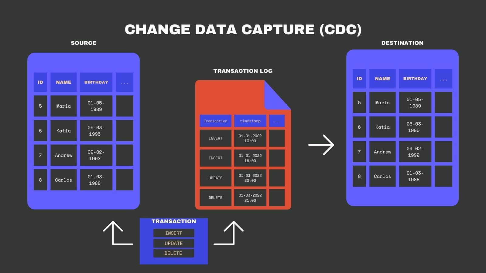
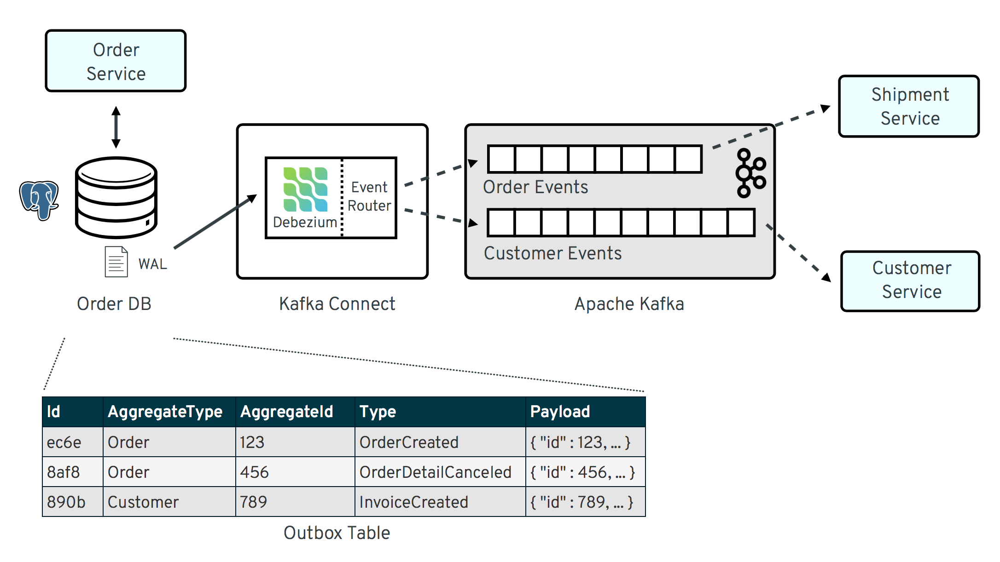

# #1. CDC란 무엇인가

- CDC: DB 로그 등을 근간으로 DB 데이터 변경 사항을 근 실시간으로 이벤트를 생성해 다른 시스템에 뿌려주는 것

- CDC의 필요성: MSA에서는 하나의 서비스에서 어떤 데이터가 변경되면, 다른 서비스도 이를 즉시 반영해야 하는 경우가 많아지는데, 이 과정을 수작업으로 API 연동이나 배치 작업을 통해 관리하면, **중복 구현**과 **지연**이 발생하기 쉽고 **데이터 불일치** 상태가 장기간 유지될 위험이 커진다. CDC는 이를 자동화해서, 데이터 변경이 발생하는 순간 DB 로그(binlog, WAL 등)를 읽어 **이벤트**를 생성해 다른 시스템(예: 메시지 **브로커**, 데이터 웨어하우스)으로 **전달**한다.

- 로그기반 CDC가 가장 많이 쓰임. (DB 벤더가 제공하는 **binlog**(MySQL), **WAL**(PostgreSQL) 등을 활용한다. 로그에는 테이블에 수행된 각 변경(INSERT, UPDATE, DELETE)이 기록되므로, 이를 파싱해 변경 사항을 추출한다. 운영 DB 스키마를 직접 폴링(polling)하지 않으므로, **부하가 적고** 정확도가 높다는 강점이 있다.)

- debezium이 많이 쓰임.

- 로그기반 한번 실습해봐야할듯...