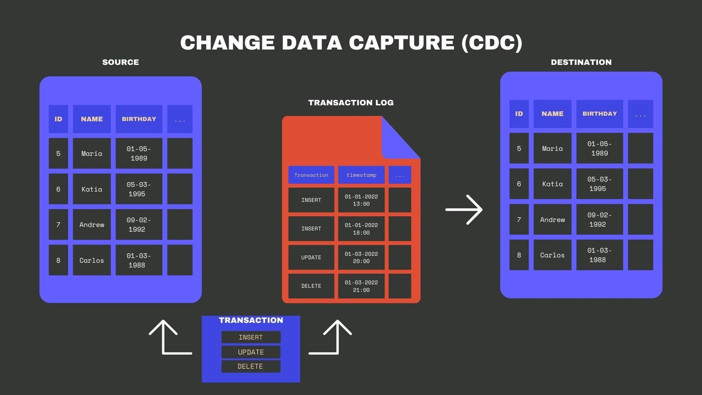

---

`250325`

---

올해 들고 굉장히 마음이 헤이해졌음을 느낀다. 카프카가 분명 정말 하고 싶었었는데 행복한 돼지가 되고픈 마음과 겹쳐 공부를 자꾸만 놓고 있었다. 이럴 순 없어!

프로덕션 환경에서 운영자 관점에서 Kafka를 이해해보고, 신규 Kafka 구축도 올해 꼭! 진행해보기 위해 25년 올해 4월까지는 현재 회사 운영 환경에서의 구조에서 잘 모르고 어려운 부분들을 잘 골라내서 self 공부해보려 한다.

# Change Data Capture(CDC)란 무엇인가

데이터가 저장된 상태에서 발생하는 변경 사항을 **실시간** 또는 **근실시간**으로 포착해 다른 시스템에 전달하는 기법을 **Change Data Capture(이하 CDC)**라고 한다. 
CDC를 활용하면 기존 시스템에 큰 수정 없이 **DB 로그** 또는 **트랜잭션 기록**을 근간으로 데이터를 추출해 간편하고 효율적인 방식으로 **데이터 동기화**를 달성할 수 있다.

- 출처: https://airbyte.com/blog/change-data-capture-definition-methods-and-benefits

---

# 그렇다면, 왜 CDC가 필요한가

여러 서비스나 모듈이 하나의 DB에만 의존하던 전통적인 구조에서 벗어나, **마이크로서비스 아키텍처(MSA)**나 **이벤트 기반 아키텍처**로 전환하려 할 때 데이터 동기화 문제는 더욱 복잡해진다. 

하나의 서비스에서 어떤 데이터가 변경되면, 다른 서비스도 이를 즉시 반영해야 하는 경우가 많아진다. 이 과정을 수작업으로 API 연동이나 배치 작업을 통해 관리하면, **중복 구현**과 **지연**이 발생하기 쉽고 **데이터 불일치** 상태가 장기간 유지될 위험이 커진다.

CDC는 이를 자동화하여, 데이터 변경이 발생하는 순간 DB 로그(binlog, WAL 등)를 읽어 **이벤트**를 생성해 다른 시스템(예: 메시지 브로커, 데이터 웨어하우스)으로 **전달**하도록 만든다.

덕분에 실시간 혹은 근실시간으로 데이터가 일치하도록 유지할 수 있으며, 데이터 동기화를 위한 추가적인 트랜잭션 로직이 필요 없다는 점이 명확해진다.

- 출처: https://debezium.io/blog/2020/02/10/event-sourcing-vs-cdc/

---

# 대표적인 CDC 접근 방식

1. **데이터베이스 로그 기반**  
   DB 벤더가 제공하는 **binlog**(MySQL), **WAL**(PostgreSQL) 등을 활용한다. 로그에는 테이블에 수행된 각 변경(INSERT, UPDATE, DELETE)이 기록되므로, 이를 파싱해 변경 사항을 추출한다. 운영 DB 스키마를 직접 폴링(polling)하지 않으므로, **부하가 적고** 정확도가 높다는 강점이 있다.

2. **테이블 폴링(polling) 기반**  
   주기적으로 테이블을 스캔해 변경된 레코드를 찾는다. 구현이 간단하지만, 데이터 양이 많아지면 성능과 정확성에서 불리해지며, 실시간성도 떨어지는 편이다.

3. **트리거 기반**  
   DB 트리거를 만들어, 레코드가 변경될 때마다 별도의 로깅 테이블 혹은 메시지를 발행하는 기법이다. DB 레벨에서 즉시 처리가 가능하지만, 트리거 관리가 번거롭고 DB 트랜잭션 시간과 부하가 늘어나는 단점이 존재한다.

이 중 **로그 기반** CDC가 가장 흔히 쓰이며, **데이터 무결성**을 유지하며 실시간에 가까운 동기화를 제공한다. 상세한 장단점을 보려면 https://datacater.io/blog/2021-08-25/mysql-cdc-complete-guide.html#cdc-triggers 여기를 참고하면 자세하게 분석되어 있다.

---

# Debezium 등 주요 CDC 도구

CDC를 실무에서 구현할 때 가장 널리 언급되는 오픈소스는 **Debezium**이다. Debezium은 [공식 문서](https://debezium.io/documentation/)에서 다양한 DB(MySQL, PostgreSQL, MongoDB 등)에 대한 커넥터를 제공하며, **Kafka Connect** 위에서 동작해 **확장성**과 **운영 편의성**을 갖췄다.

- **Apache Kafka**와 연동 시, DB 변경을 이벤트(메시지) 형태로 **카프카 토픽**에 퍼블리시하므로, 다른 마이크로서비스나 애플리케이션에서 이를 쉽게 구독(Consume)할 수 있다.  
- 특정 테이블만 골라내거나, **Outbox Table**(다른 글에서 자세히 다룰 예정) 형태를 통해 **이벤트 발행**을 구조화할 수 있다는 점도 장점이다.

이 밖에도 **Attunity**, **Oracle GoldenGate** 등 상용 솔루션이 존재하지만, 오픈소스 생태계에서는 Debezium이 사실상 표준처럼 쓰이고 있다.

- 출처: https://debezium.io/blog/2019/02/19/reliable-microservices-data-exchange-with-the-outbox-pattern/

---

# CDC의 추가 장점

1. **실시간 데이터 파이프라인**  
   DB에서 발생하는 모든 변경 사항이 곧바로 다른 애플리케이션이나 분석 플랫폼, 데이터 웨어하우스, 검색 엔진(Elasticsearch 등)으로 전달되므로, **최신 상태**가 즉각적으로 반영된다.

2. **데이터 불일치 위험 축소**  
   기존에는 DB 변경 후 별도의 API 호출이나 배치 작업으로 타 시스템을 동기화했는데, 이 과정에서 오류나 지연이 발생하면 데이터가 어긋날 수 있다. CDC를 통해 DB 변경 사실을 **단일 소스**(DB 로그)에서 직접 추출하면, 누락 또는 중복을 최소화할 수 있다.

3. **애플리케이션 결합도 낮춤**  
   마이크로서비스 간 통신을 이벤트 중심으로 재구성할 수 있다. DB 변경 → 이벤트 발행 → 다른 마이크로서비스 소비 형태로 흐름이 정리되므로, 한 서비스를 변경해도 다른 서비스와의 API 계약을 크게 수정하지 않아도 되는 경우가 많아진다.

4. **확장성**  
   CDC 방식은 DB 로그만 읽어오기 때문에, 데이터 수가 많아져도 DB 운영 로직이나 소스 코드를 크게 수정할 필요가 없다. Debezium처럼 **Kafka Connect**를 활용하면 워커 노드를 확장하여 대량의 변경사항도 안정적으로 처리할 수 있다.

---

# 추가 참고 링크
- **Debezium 공식 문서**  
  [https://debezium.io/documentation/](https://debezium.io/documentation/)  
  다양한 CDC 시나리오와 설정 방법, Outbox Event Router 등 고급 기능 소개.

- **Confluent Kafka Connect 문서**  
  [https://docs.confluent.io/platform/current/connect/index.html](https://docs.confluent.io/platform/current/connect/index.html)  
  Kafka Connect 프레임워크 개요, 커스텀 커넥터 작성법 및 운영 방법 등 설명.

- **Attunity(현 Qlik Replicate)**, **Oracle GoldenGate** 등 상용 솔루션  
  실시간 대용량 CDC를 제공하는 고급 기능이 많지만, 라이선스 비용과 운영 복잡도를 고려해야 한다.

---

# 마무리
CDC를 적용하면 DB 로그를 바탕으로 모든 변경 사항이 **이벤트**로 흘러가게 되므로, 데이터 동기화와 마이크로서비스 연동이 한결 명확해진다. 특히 실시간 분석, 이벤트 드리븐 아키텍처, 마이크로서비스 구축을 고민하는 상황에서 CDC 도입은 탁월한 선택이 될 가능성이 높다.

다만 CDC만으로는 **어떤 시점**에 **어떤 이벤트**를 발행할지에 대한 설계가 완전히 해결되지는 않는다. 이를 더 안정적으로 다루려면, “Outbox Table 패턴”을 통해 **트랜잭션 일관성**과 **이벤트 관리**를 더욱 철저히 하는 방법을 권장한다. 다음 글에서는 Outbox Table 패턴에 대해 살펴볼 예정이다.

