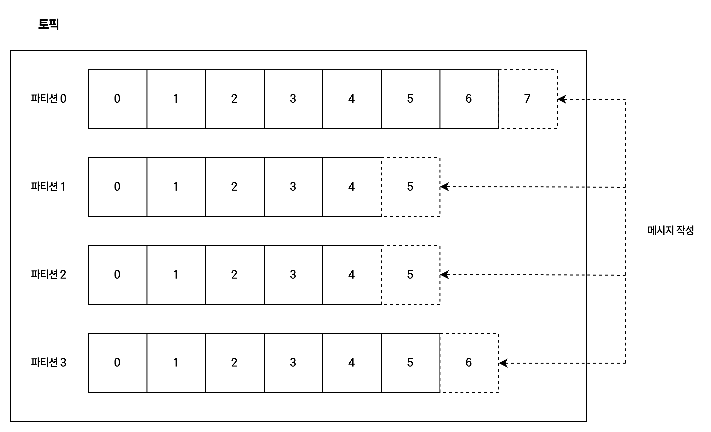
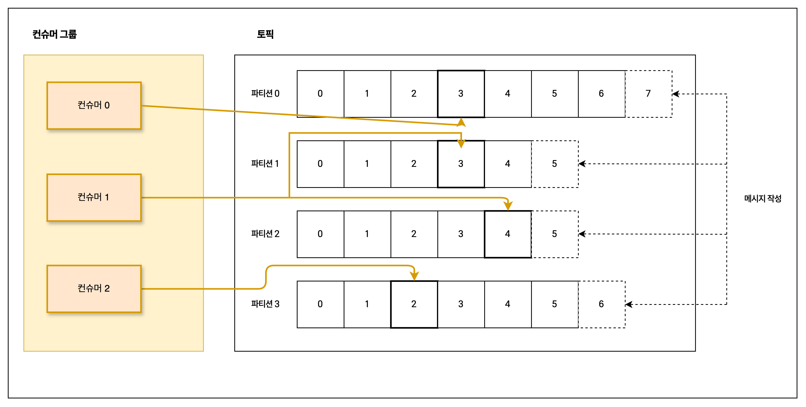
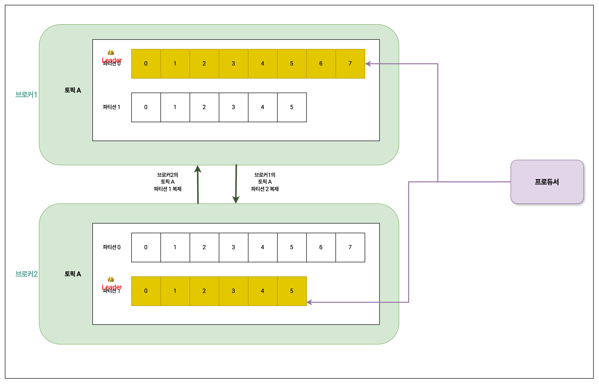

카프카는 **메시지 발행/구독 시스템**

## 1.2.1 메시지와 배치
- **메시지**: 데이터의 기본 단위
	- 키: 메시지를 저장할 파티션을 결정하기 위해 사용됨.
- 카프카는 효율성을 위해 메시지를 **배치 단위**로 저장함.
	- 배치 크기가 커질수록 시간당 처리되는 메시지 수는 늘어나지만,
	- 각각의 메시지가 전달되는 데 걸리는 시간은 늘어남.

## 1.2.2 스키마
- 가장 간단한 건 **JSON, XML**
	- 단점: 타입 처리 기능, 스키마 버전 간의 호환성 유지 기능이 떨어짐
- **Avro**
  - 조밀한 직렬화 제공
  - 메시지 본체와 스키마를 분리하기 때문에 스키마 변경 시에도 코드 생성이 필요 없음
  - 강력한 데이터 파이핑
  - 스키마 변경에 따른 상/하위 호환성 제공

## 1.2.3 토픽과 파티션

- **토픽**: 메시지 분류 단위
  - DB에서는 **테이블**과 유사, 파일시스템에서는 폴더와 유사
- **파티션**
  - 커밋로그 관점에서 하나의 **로그**에 해당
  - 추가만 가능함.
  - 토픽에 여러 개의 파티션이 있기 때문에 토픽 안의 메시지들 간에는 순서 보장이 안되고, **단일 파티션 내에서 순서만 보장**.
  - 각 파티션이 다른 서버들에 분산 저장 될 수도 있음.
- 스트림: (파티션의 개수와 관계 없이) 하나의 토픽에 저장된 데이터

## 1.2.4 프로듀서와 컨슈머
- **프로듀서**: 새로운 메시지 생성
  - 기본적으로는 파티션들 사이에 고르게 나눠서 쓰나, 특정한 파티션을 지정해서 쓰기도 함. (**파티셔너** 사용해서 구현)
- 컨슈머: 메시지를 읽음
  - 1개 이상의 토픽을 구독해서 여기에 저장된 메시지들을 읽어옴.
  - 메시지의 **오프셋**을 기록해서 어느 메시지까지 읽었는 지를 유지. (**파티션별로 다음 번에 사용 가능한 오프셋 값을 저장**하기 때문에 읽기 작업을 정지했다가 다시 시작해도 마지막으로 읽었던 메시지의 바로 다음 메시지부터 읽을 수 있음.)
- **컨슈머 그룹**: 하나 이상의 컨슈머로 이루어짐.
  - 각 파티션이 하나의 컨슈머에 의해서만 읽히도록 함. 컨슈머에서 파티션으로 대응 관계를 **컨슈머의 파티션 소유권** 이라고도 부름.

## 1.2.5 브로커와 클러스터
- **브로커**: 하나의 카프카 서버
  - **프로듀서로부터 메시지를 전달받아 오프셋을 할당한 뒤 디스크 저장소에 씀**.
  - 컨슈머의 파티션 읽기 요청을 처리해서 메시지를 보내줌.
- 하나의 **클러스터** 안에 여러 브로커가 포함
  - 하나의 브로커가 컨트롤러 역할을 하여 파티션을 브로커에 할당해 주거나 장애가 발생한 브로커의 모니터링을 함. = **파티션 리더**
  - 나머지는 **팔로워**. 파티션의 메시지를 중복 저장(복제)하여 리더 브로커에 장애가 발생했을 때 리더를 이어받을 수 있도록 함.
  - **모든 프로듀서는 리더 브로커에 메시지를 발행해야 하지만 컨슈머는 리더, 팔로워 모두 중 하나에서 데이터를 읽어올 수 있음**.

## 1.2.6 다중 클러스터
다수의 데이터센터에서 카프카가 운용될 때 데이터센터 간에 메시지를 복제해 줄 필요가 있을 수 있는데 이 경우 **미러메이커** 사용 가능.