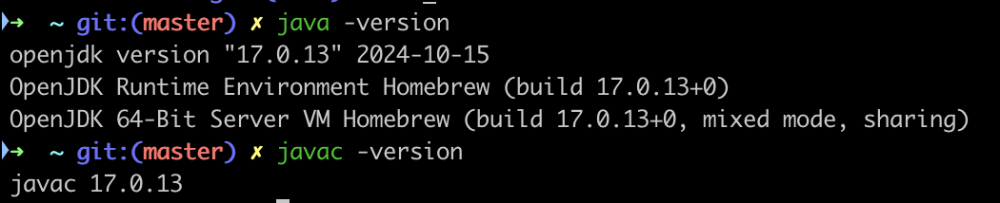
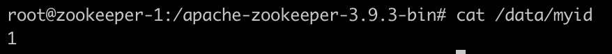
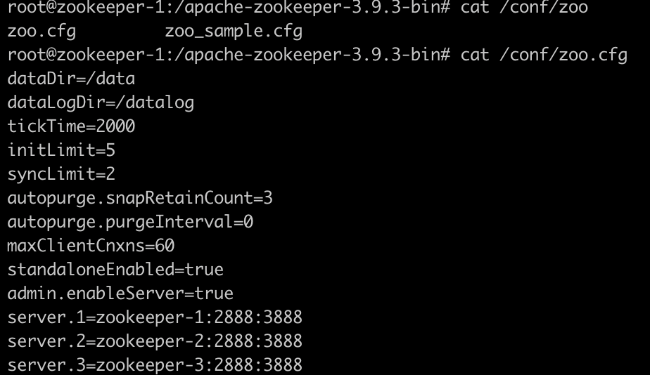

## 2.1.1 운영체제 선택하기
다양한 운영체제에서 실행이 가능하나, 대체로 리눅스가 권장.

## 2.1.2 자바 설치하기
카프카와 주키퍼는 모든 OpenJDK 기반 자바 구현체 위에서 원할히 작동하니, jdk 설치를 해야함.



## 2.1.3 주키퍼 설치하기
- 주키퍼는 카프카 클러스터의 메타데이터와 컨슈머 클라이언트에 대한 정보를 저장하기 위해 사용 됨.

- 주키퍼 앙상블
  - 주키퍼는 고가용성을 보장하기 위해 앙상블이라 불리는 클러스터 단위로 작동하도록 설계되어 있음.
  - 앙상블은 보통 홀수 개의 서버 권장. 주키퍼가 요청에 응답하려면 앙상블 멤버(=**쿼럼**)의 과반 이상이 응답해야 하기 때문. (만약 3대중 1대의 노드가 죽어도 문제없이 동작한다는 뜻.)

- image는 https://hub.docker.com/_/zookeeper 공식 도커 이미지 latest 사용함.

```yaml
version: '3.8'

services:
  zookeeper1:
    image: confluentinc/cp-zookeeper:7.6.0
    hostname: zookeeper1
    container_name: zookeeper1
    ports:
      - "2181:2181"
    environment:
      ZOOKEEPER_SERVER_ID: 1
      ZOOKEEPER_CLIENT_PORT: 2181
      ZOOKEEPER_TICK_TIME: 2000
      ZOOKEEPER_SERVERS: zookeeper1:2888:3888;zookeeper2:2888:3888;zookeeper3:2888:3888

  zookeeper2:
    image: confluentinc/cp-zookeeper:7.6.0
    hostname: zookeeper2
    container_name: zookeeper2
    ports:
      - "2182:2181"
    environment:
      ZOOKEEPER_SERVER_ID: 2
      ZOOKEEPER_CLIENT_PORT: 2181
      ZOOKEEPER_TICK_TIME: 2000
      ZOOKEEPER_SERVERS: zookeeper1:2888:3888;zookeeper2:2888:3888;zookeeper3:2888:3888

  zookeeper3:
    image: confluentinc/cp-zookeeper:7.6.0
    hostname: zookeeper3
    container_name: zookeeper3
    ports:
      - "2183:2181"
    environment:
      ZOOKEEPER_SERVER_ID: 3
      ZOOKEEPER_CLIENT_PORT: 2181
      ZOOKEEPER_TICK_TIME: 2000
      ZOOKEEPER_SERVERS: zookeeper1:2888:3888;zookeeper2:2888:3888;zookeeper3:2888:3888
```

- 띄우고, `docker exec -it zookeeper-1 bash` 통해 서버 접속.
- data 디렉토리 하위 myid에서 주키퍼 id 확인 가능



- `/conf/zoo.cfg` 통해 설정 확인 가능
    - initLimit: 초기화 제한시간 (이 시간 동안 팔로워가 리더와 연결 못하면 초기화에 실패)
    - syncLimit: 동기화 제한시간 (이 시간 동안 팔로워가 리더와 연결 못하면 동기화 풀림)
    - 두 값 모두 tickTime 단위로 정의되어 이경우 초기화 제한 시간이 20 * 2000 밀리초인 것.
    - 앙상블 안의 서버도 정의되며, server.{x}={hostname}:{peerport}:{leaderport} 형태

